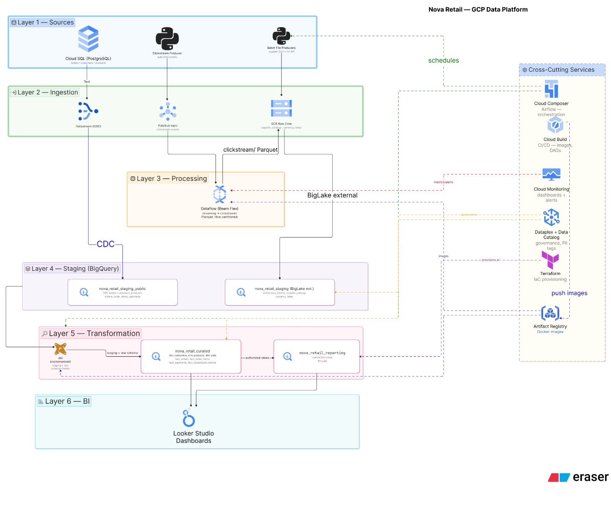
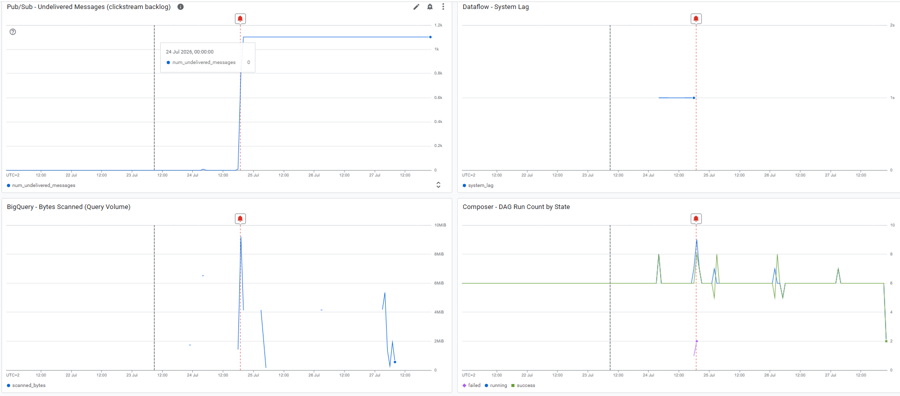
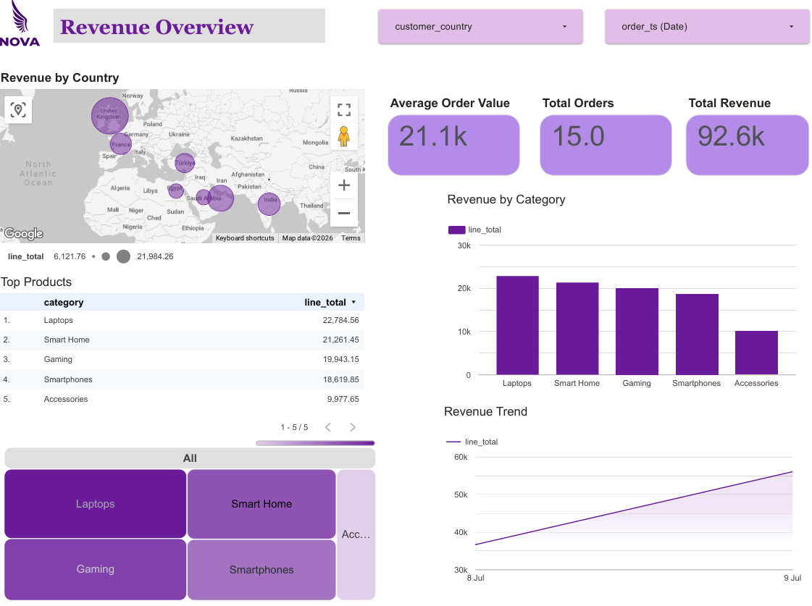
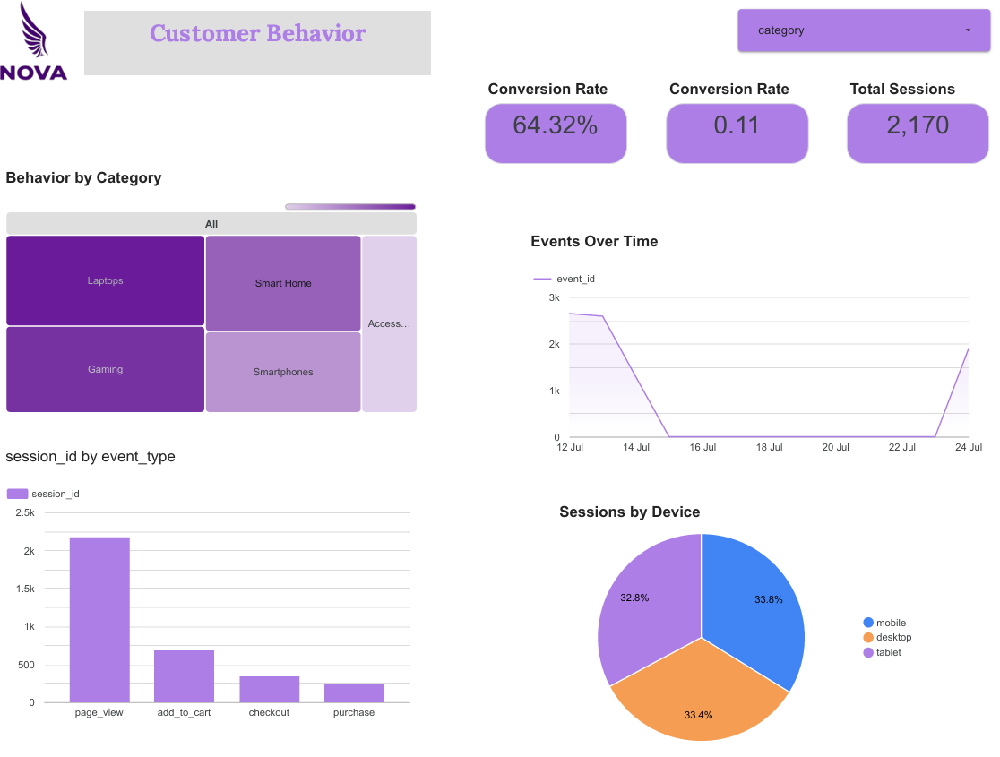
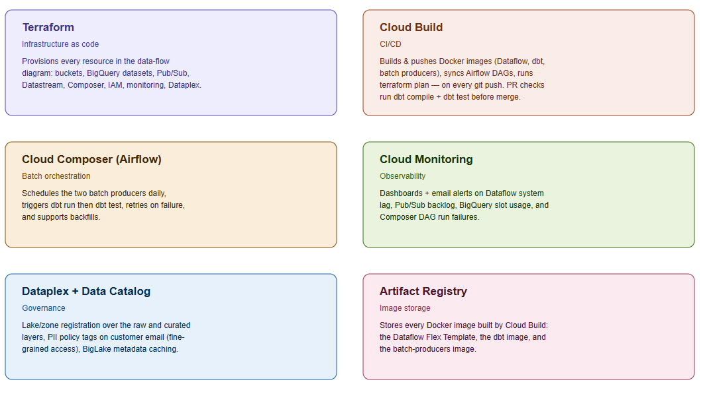
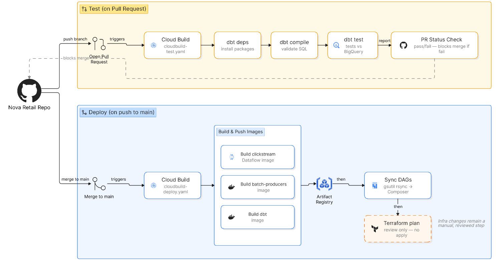

# Nova Retail — End-to-End GCP Data Platform

A production-style data platform simulating an online retail business, built to
demonstrate batch and streaming ingestion, CDC, orchestration, transformation,
CI/CD, monitoring, and governance — all provisioned as infrastructure as code.

## 🛠 Tech Stack

| Layer | Technology |
|---|---|
| **Infrastructure as Code** |  |
| **Streaming** |   |
| **Database CDC** |   |
| **Warehouse** |   |
| **Transformation** |  |
| **Orchestration** |  |
| **CI/CD** |   |
| **Governance** |   |
| **Monitoring** |  |
| **BI** |  |

---

## 🏗 Architecture

### Data flow (sources to BI)



Three independent sources feed the same warehouse, joinable on shared
`customer_id`/`product_id` keys:

- **Database CDC** (blue) — Cloud SQL (PostgreSQL) replicated via Datastream
- **Streaming** (coral) — a clickstream producer publishing to Pub/Sub, consumed
  by a Dataflow (Apache Beam) streaming job, landing as Hive-partitioned Parquet
- **Batch files** (green) — a daily supplier catalog feed and a live currency
  exchange rate API, landed as CSV

Both staging layers are read by **dbt**, which builds a star schema
(`dim_customers`, `dim_products`, `dim_date`, `fact_orders`, `fact_order_items`,
`fact_payments`, `fact_clickstream_events`) plus a PII-safe reporting layer for
BI consumption.

## 📊 Observability & Insights

### Platform Health Dashboard
Monitoring the "Golden Signals" of the pipeline using Google Cloud Monitoring.

*   **Pub/Sub Backlog:** Tracks undelivered messages to alert on pipeline stalls.
*   **Dataflow System Lag:** Real-time visibility into processing latency.
*   **BigQuery Usage:** Monitoring query volume and scanned bytes.
*   **Composer Health:** Tracking DAG success/failure rates.


### Business Analytics (Looker Studio)
Final curated data served to stakeholders via a PII-safe reporting layer.


*   **Conversion Funnel:** Visualizing the journey from `page_view` to `purchase`.
*   **Sales Trends:** Daily revenue performance across product categories.
*   **Customer Geography:** Global distribution of active retail users.

### Cross-cutting services



These six services don't sit in the linear data flow — they provision,
orchestrate, build, monitor, and govern everything shown above.

### CI/CD Pipeline

Why, what, and how

Why: Right now, every deploy step is manual — you run build_and_push.sh, run_pipeline.sh, gsutil cp for DAGs, terraform apply, by hand, from your terminal. CI/CD's job is to make git push alone trigger the right subset of that automatically.

What Cloud Build will do on every push to main:

Build and push the 3 Docker images (clickstream Dataflow pipeline, batch producers, dbt) to Artifact Registry
Sync your dags/ folder to Composer's DAG bucket automatically (no more manual gsutil cp)
Run terraform plan (not apply) so infra changes are visible in the build log

Why plan, not apply, for Terraform specifically: This is a deliberate, defensible senior decision, not a shortcut. Auto-applying infrastructure changes on every push means a bad terraform edit could silently destroy/recreate real resources (a Cloud SQL instance, a BigQuery dataset with data in it) with no human in the loop. Rebuilding a Docker image or syncing a DAG file is safe and idempotent — nothing bad happens if it reruns. Terraform apply is not. Real production setups very commonly keep infra changes gated behind a human clicking "approve" even with full CI/CD elsewhere. We can upgrade to auto-apply later if you want, but I'd recommend against it for now.

How, mechanically: A cloudbuild.yaml file at your repo root defines the steps. A Cloud Build Trigger watches your GitHub repo and runs that file on push. Cloud Build itself runs the steps under a service account (currently cloud-build-deployer, which we already created) with permissions scoped to exactly what each step needs

## Repository structure

```
Infrastructure_Terraform/   All GCP infrastructure (buckets, BigQuery, Pub/Sub,
                             Datastream, Composer, IAM, monitoring, Dataplex)
Pipelines/dataflow/          Clickstream streaming pipeline (Apache Beam)
data_sources/                Postgres seed/order generator, clickstream producer,
                             batch producers (supplier catalog, currency rates)
dbt_nova_retail/              dbt project: staging models, star schema, tests
dags/                        Airflow DAG for batch orchestration
scripts/                     Setup and deployment helper scripts
cloudbuild-test.yaml          CI: runs on every pull request (dbt compile + test)
cloudbuild-deploy.yaml        CD: runs on push to main (build/push images, deploy)
docs/                        Architecture diagrams
```

## Tech stack

| Layer | Technology |
|---|---|
| Infrastructure as code | Terraform |
| CDC | Datastream |
| Streaming | Pub/Sub, Dataflow (Apache Beam) |
| Batch ingestion | Python, Cloud Storage |
| Data lake | Cloud Storage (Hive-partitioned Parquet/CSV) |
| Warehouse | BigQuery (native + BigLake external tables) |
| Transformation | dbt |
| Orchestration | Cloud Composer (Airflow) |
| CI/CD | Cloud Build |
| Monitoring | Cloud Monitoring |
| Governance | Dataplex, Data Catalog policy tags, Secret Manager |
| BI | Looker Studio |

## Setup

1. `Infrastructure_Terraform/scripts/bootstrap.sh <PROJECT_ID>` — one-time API
   enablement and auth
2. `terraform apply` — provisions all infrastructure
3. Build and push the three Docker images (clickstream pipeline, batch
   producers, dbt) via their respective `build_and_push*.sh` scripts, or let
   Cloud Build handle it on push to `main`
4. Upload the DAG to Composer's DAG bucket (or let Cloud Build sync it)
5. Connect Looker Studio to `nova_retail_curated` / `nova_retail_reporting`

See inline comments in each script and `.tf` file for prerequisites specific
to each component (e.g. Datastream needs a Postgres replication user created
manually before `terraform apply`).

## Notable design decisions

- **Terraform never auto-applies from CI** — `cloudbuild-deploy.yaml` runs
  `terraform plan` only. Infrastructure changes stay a manual, reviewed step
  even with full CI/CD elsewhere in the pipeline.
- **BigLake over plain external tables** — the GCS-backed staging tables use a
  BigLake connection for metadata caching and Dataplex-integrated governance,
  not just raw external tables.
- **PII policy tags applied via dbt, not Terraform** — the taxonomy/tag
  definition lives in Terraform, but the tag is applied to `dim_customers.email`
  via dbt's `policy_tags` column config, since that table is dbt-managed.
- **Authorized views for safe BI access** — `nova_retail_reporting` exposes
  PII-free views so BI tools never need direct grants on the curated dataset.

## Lessons learned

Deploying the Dataflow streaming pipeline surfaced a chain of real production
issues worth documenting: IAM propagation delays, GCP zone capacity exhaustion,
a Dockerfile `ENTRYPOINT` override that silently broke the SDK harness's
ability to run in worker mode, and a `ModuleNotFoundError` caused by
`save_main_session` needing local modules on the worker's `PYTHONPATH`. Each
is documented inline in the relevant script/Dockerfile comments.